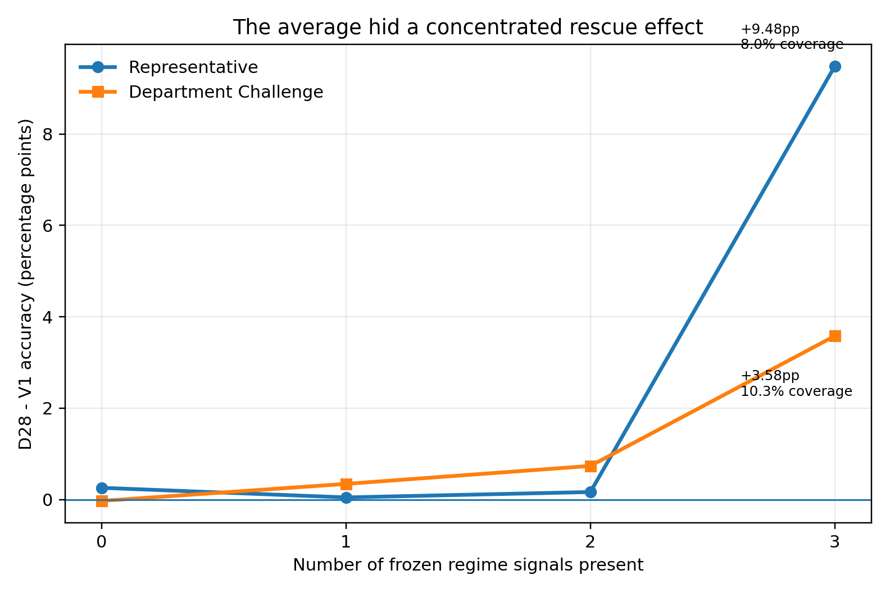
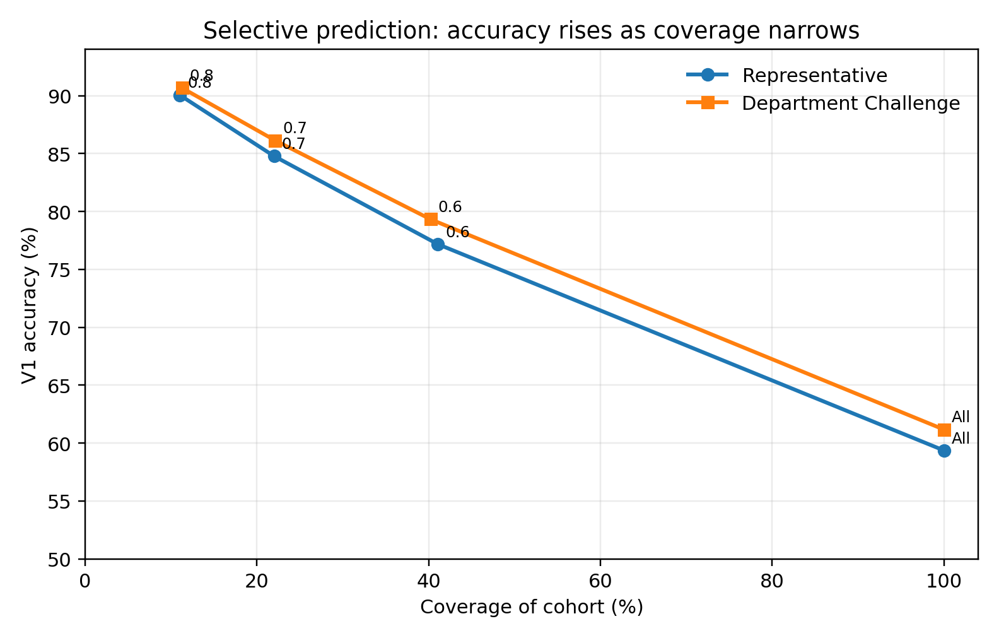
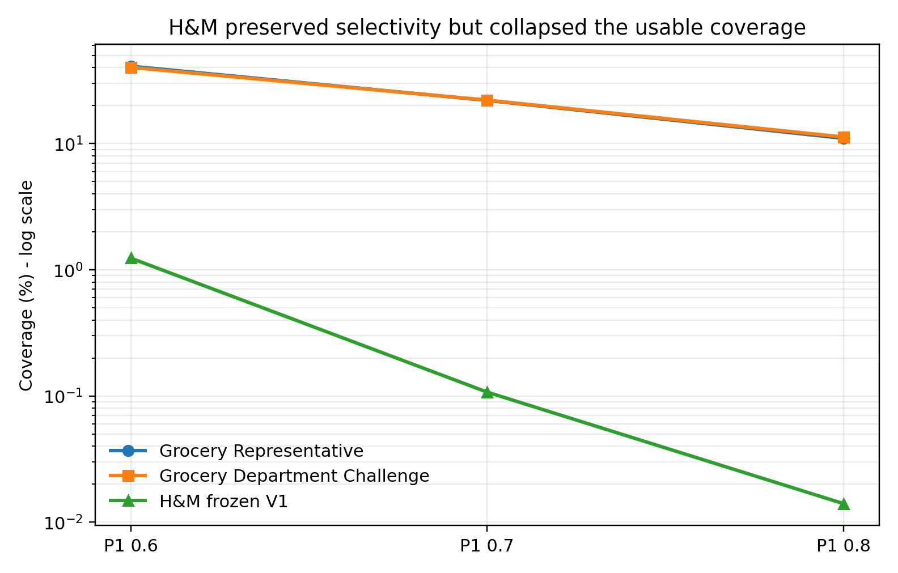
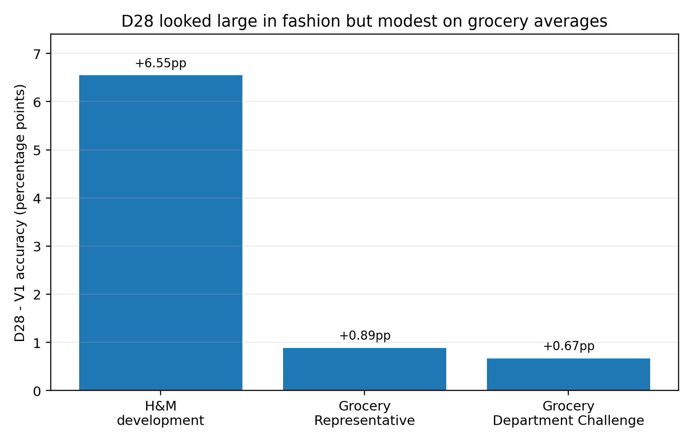
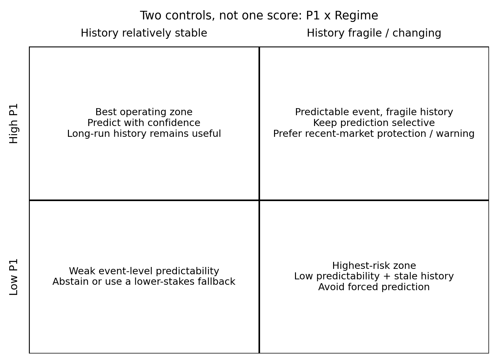

# 當歷史開始失效：消費預測中的選擇性預測與市場狀態韌性

**知道哪些事件值得預測還不夠；還要知道支撐預測的歷史市場結構是否仍然可信。**

**作者：** Ting-Yi Lin / 林庭億，Independent Researcher（獨立研究者）  
ORCID（研究者識別碼）：0000-0002-1018-8735

## 執行摘要

企業常先問：「模型平均準確率是多少？」這個問題不夠好。實際部署時有兩個不同風險：第一，有些事件本來就不值得強制預測；第二，即使事件看起來可預測，模型依賴的歷史市場結構也可能已經變舊。

MRSP Phase 2（第二階段）因此把問題拆成兩層：

1. **Selective Prediction（選擇性預測）：這一筆事件值得預測嗎？**
2. **Regime Resilience（市場狀態韌性）：目前的歷史市場資訊還值得相信嗎？**

在 Grocery（食品零售）資料中，凍結的 P1（可預測性分數）形成清楚的 accuracy-coverage frontier（準確率-覆蓋率前緣）：全部事件約 **60-62%**；只保留較可預測事件後，約 **40% 覆蓋率可達 78-79%**、**22% 可達 85-86%**、**11% 可達 90-91%**。

但 H&M（服飾零售）外部壓力測試暴露另一個問題。Frozen V1（凍結第一版）在 292,846 個事件上的平均準確率只有 **43.52%**。P1 仍然能挑出較容易的事件，但舊門檻下可用覆蓋率幾乎消失；大量事件缺乏同類別個人歷史。

把累積市場先驗改成最近 28 天的 D28（28 日近期市場先驗）後，H&M 開發結果從 **43.52% 升到 50.07%，+6.55 個百分點**。但這是在看到 H&M 問題之後開發的，因此**不是獨立 V2 外部驗證**。

真正重要的是把同一個 28 天視窗、不重新搜尋參數，帶回 Grocery。平均改善只有 **+0.89pp（百分點）**與 **+0.67pp**，看起來很小；但改善高度集中在少數市場轉移狀態。

三個凍結的 Regime Signals（市場狀態訊號）同時出現時：

- Representative（代表樣本）：**42.70% -> 52.18%，+9.48pp**，只佔約 **8.0%** 事件；
- Department Challenge（部門挑戰樣本）：**43.61% -> 47.19%，+3.58pp**，約 **10.3%** 事件。

因此 D28 的價值不是讓所有事件平均變好，而是主要在**歷史市場結構較可能失效的少數狀態中提供 failure protection（失效保護）**。

## 一、為什麼平均準確率不是最好的起點

把所有事件混在一起計算平均，會同時混入成熟與冷啟動的客戶關係、容易與模糊的選擇、穩定與快速變化的市場。對企業而言，更合理的問題是：**在什麼可預測性水準下，這個預測值得拿去行動？**

P1 使用事件發生前的個人歷史結構，包括歷史成熟度、選擇集中度、entropy（熵）、switch rate（切換率）與近期集中度。它不是拿來讓每筆事件都更準，而是用來控制「要不要回答」。

以 Representative 樣本為例，V1 從全部事件的 **59.37%**，提高到：

- **77.17%** @ 41.08% coverage（覆蓋率）
- **84.78%** @ 22.00%
- **90.06%** @ 11.01%

所以正確說法不是「模型有 90% 準確率」，而是：「在這個資料環境與凍結門檻下，大約一成事件達到約 90% 的準確率區域。」

## 二、P1 解決的是『事件值不值得預測』

Selective Prediction（選擇性預測）適合有行動成本的場景，例如推薦欄位、個人化優惠、人工審核、補貨或行銷觸發。當低可預測事件可以選擇 abstain（棄權）時，企業不必要求模型對每一筆資料都強制回答。

但這只解決第一個問題。

## 三、隱藏假設：歷史市場仍然代表現在

V1 會使用歷史市場先驗。因此，即使家庭層級的行為很穩定，市場端仍然存在一個隱含假設：**過去的市場結構對現在仍然有代表性。**

H&M 就是在這裡暴露問題。

高 P1 事件仍然比較準，但凍結門檻對應的 coverage（覆蓋率）只剩 **1.24%、0.107%、0.014%**。也就是說，排序能力沒有完全消失，但舊的操作區域幾乎不能直接搬過去。

## 四、近期市場資訊為什麼重要

D28 只改市場先驗：使用事件發生前最近 28 天、其他客戶的市場行為；個人歷史仍然使用累積資訊。

H&M 的開發結果顯示 **+6.55pp**，但真正有價值的證據不是這個數字本身，而是後續「不重新搜尋 Grocery 視窗」的回傳測試。

在 Grocery 的平均提升很小，卻不是均勻分布。

## 五、平均值藏掉了真正的救援區域

三個市場狀態訊號分別代表：

1. distribution shock（分布衝擊）：D28 與較長 D91 市場分布差異夠大；
2. leader switch（領先商品切換）：長期市場第一名與近期第一名不同；
3. local old-leader absence proxy（近期在地舊領先者缺席代理訊號）：長期領先商品在近期同店、同選擇集合、其他客戶購買支援中沒有出現。

第三個訊號只是近期在地支援的 proxy（代理變數），**不能解讀成缺貨或貨架不可得的證據**。

在 Representative 中，0、1、2 個訊號時 D28 與 V1 很接近；三個同時出現時才跳到 **+9.48pp**。Department Challenge 也維持正方向，但幅度較小，為 **+3.58pp**。

這支持一個比「D28 比 V1 好」更實用的結論：**近期市場資訊的價值主要集中在歷史結構較脆弱的狀態。**

## 六、為什麼不直接做聰明切換器

研究測過 LOW_SHOCK（低衝擊）用 V1、HIGH_SHOCK（高衝擊）用 D28 的 Binary Gate（二元閘門）。它比 V1 好，但沒有打敗全部事件直接使用 D28。

固定的 Linear State Weighting（線性狀態加權）也沒有在兩個 cohort（樣本群）中穩健勝過 D28。

所以目前沒有證據支持增加更複雜的 router（路由器）。Regime Signals 更適合被當成**歷史有效性監測與風險訊號**，而不是已驗證的模型切換規則。

## 七、最終框架：兩個軸，不是一個總分

P1 與 Regime 回答不同問題：

- P1：事件本身的 absolute predictability（絕對可預測性）如何？
- Regime：長期市場歷史是否脆弱？近期市場資訊的 rescue value（救援價值）是否上升？

所以兩者的百分點改善不能直接相加。

## 八、企業今天可以怎麼用

目前證據支持的是 decision architecture（決策架構），不是已經完成所有外部驗證的 production algorithm（正式生產演算法）。

**事件層：**先計算可預測性，再決定 predict / abstain（預測／棄權）。  
**市場層：**持續監測近期市場與長期歷史是否分離；當多個狀態訊號同時出現，提高對舊歷史的警戒，優先考慮近期資訊或降低決策信心。

對 recommendation system（推薦系統）、personalization（個人化）、retail forecasting（零售預測）、targeted offers（精準優惠）等依賴歷史行為的系統，這比只追求單一平均準確率更接近實際部署問題。

## 九、目前不能宣稱什麼

不能宣稱：普遍 90% 準確率、普遍 +9.5pp、Regime 是因果機制、D28=28 天普遍最優、Binary Gate 優於 D28、Promotion（促銷）是主要機制、H&M D28 已完成獨立 V2 外部驗證，或 W54-W102 已完成乾淨時間外驗證。

## 十、下一步真正值得做的研究

下一步最高價值不是繼續在現有資料調參，而是找**新的市場或真正更晚的資料環境**，在看結果前先凍結 P1、D28 與 Regime 定義，再檢驗：

1. Selective Prediction 的 accuracy-coverage frontier 是否仍成立；
2. 凍結 Regime Signals 是否仍能找到近期市場資訊救援較大的狀態。

如果成立，這才會把目前的實務框架推進成更有力的 generalization（泛化）主張。

## AI 使用揭露

本研究使用生成式 AI（人工智慧）協助文獻發現、研究流程設計、程式與發布資產製作、草稿、編輯與翻譯。所有科學主張、證據邊界、數值結果與最終發布決策均在作者監督下審查，作者對最終內容負責。

## 公開資料

- English authoritative version（英文權威版）：[`ARTICLE.md`](ARTICLE.md)
- Technical Appendix（技術附錄）：[`technical/TECHNICAL_APPENDIX.md`](technical/TECHNICAL_APPENDIX.md)
- Evidence Ledger（證據帳本）：[`evidence/CLAIM_EVIDENCE_LEDGER.csv`](evidence/CLAIM_EVIDENCE_LEDGER.csv)
- Zenodo DOI（數位物件識別碼）：10.5281/zenodo.22969898
- GitHub（程式碼託管平台）：https://github.com/Ting-YiLin/mrsp-phase2-regime-resilience

Copyright (c) 2026 Ting-Yi Lin. All rights reserved.
